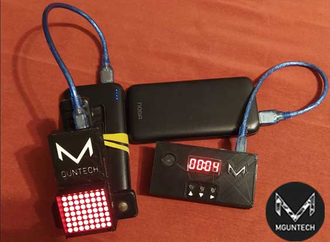
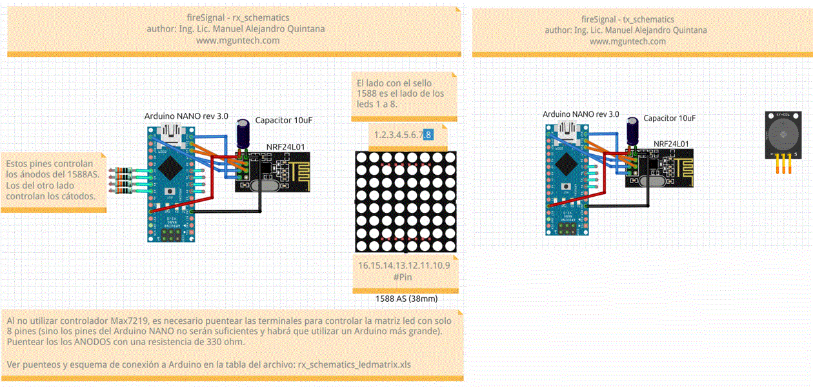

# fireSignal

**fireSignal** is an electronic device that enables rapid-fire shooting practice across various disciplines. Before each round of shots, a timer is set to indicate to the shooter when to begin firing and when to stop.

## Features

- ⏱️ Allows setting intervals from **1 second up to 99 minutes**
- 🔊 Features two indicators: **visual and audible**
- 🎯 Ideal for shooting ranges without automated target systems (e.g., FBI-style practice)
- 👤 Eliminates the need for an assistant instructor

## DIY! 🛠️

I no longer offer it in the Mguntech website, but you can build you own just following the published schematic

To build the device, the following components are required:

### 🔧 Hardware

- Arduino Nano V3 CH340 (x2)
- NRF24L01 module (x2)
- 5V 1A power bank (x2)
- 8x8 LED matrix with MAX7219 controller
- 3-pin beeper
- 4-pin push button (x3)
- 4-digit 7-segment display with TM1637 controller
- 3D printer (for enclosure)
- Connection wires
- Prototyping board

### 💻 Software

- Arduino IDE

